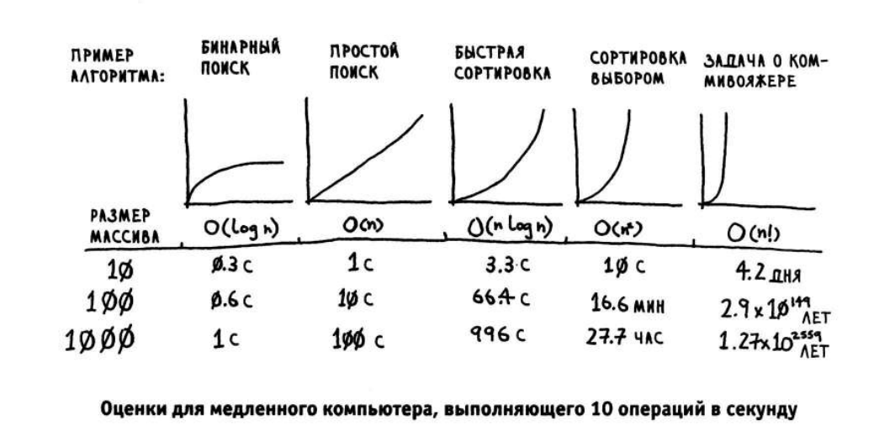

# Алгоритмы
- [Алгоритмы](#алгоритмы)
  - [Бинарный поиск и О-большое](#бинарный-поиск-и-о-большое)
  - [Структуры данных](#структуры-данных)
  - [Сортировка и рекурсия](#сортировка-и-рекурсия)
  - [Хеш-таблицы](#хеш-таблицы)
  - [Графы и поиск путей](#графы-и-поиск-путей)
  - [Жадные алгоритмы и множества](#жадные-алгоритмы-и-множества)
  - [Динамическое программирование](#динамическое-программирование)
  - [Машинное обучение и классификация](#машинное-обучение-и-классификация)
  - [Деревья и поисковые системы](#деревья-и-поисковые-системы)
  - [Преобразования, параллелизм и криптография](#преобразования-параллелизм-и-криптография)

## Бинарный поиск и О-большое
**Бинарный поиск** сокращает вдвое количество попыток нахождения нужного объекта, путем помещения его в определенный диапазон. В таком случае, алгоритм завершается через логарифмическое время.

Вместо подсчета времени выполнения алгоритма **"О-большое"** позволяет сравнивать количество операций. Выглядит запись так: `O(n)`, где `n` - количество попыток. Оно также отражает время выполнения в худшем случае, так как в нем содержится максимальное число попыток. Помимо этого оно отражает именно темп роста количества операций.

Примеры "О-большого":
- `O(log n)`, или логарифмическое время. Пример: бинарный поиск.
- `O(n)`, или линейное время. Пример: простой поиск.
- `O(n * log n)`. Пример: эффективные алгоритмы сортировки (быстрая сортировка).
- `O(n²)`. Пример: медленные алгоритмы сортировки (сортировка выбором).
- `O(n!)`. Пример: очень медленные алгоритмы (задача о коммивояжёре).

**Загадка коммивояжёра** раскрывает проблему сложности нахождения эффективного решения из-за большого количество вариантов. Коммивояжер может проехать через все `n` городов по `О(n!)` дорогам.

Зависимость в задаче о коммивояжере называется факториальной. Эта задача и задача покрытия множеств являются NP-полными. Как правило, их решают с помощью **приближенного алгоритма**. Есть пара характерных признаков:
- алгоритм работает быстро при малом количестве элементов, но сильно замедляется с увеличением их числа;
- формулировка “все комбинации Х”;
- приходится вычислять все возможные варианты Х;
- имеется некоторая последовательность или множество.

## Структуры данных
Для хранения информации используются **массивы** и **связанные списки**:
- Массив похож на шкаф с ограниченным количеством ящиков, у каждого из которых имеется свой индекс. Благодаря индексу быстрее происходит поиск элементов. Но при изменении порядка (вставки или удаления) информации, нужно изменить индексы последующих элементов, чтобы вернуть целостную структуру. Стоит отметить, что все элементы массива должно быть однотипными. 
- Связанный список напоминает цепочку, элементы которой легко можно отсоединить, чтобы добавить новые или убрать старые. Но при поиске информации по этой цепи  приходится проходиться по каждому элементу. Facebook для хранения имен пользователей использует гибрид - массив связанных списков.

## Сортировка и рекурсия
**Сортировка выбором** происходит за счет определения конкретного параметра, по которому и сортируются n-количество элементов в определенном порядке, что соответствует `O(n^2)`. При "О-большом" игнорируются константы по типу ½.

**Рекурсия** - обращение функции к самой себе. При ней происходит создание стека вызовов. На ней основана стратегия “разделяй и властвуй”, в которой происходит разделение группы элементов до базового случая. В качестве базового случая часто применяют пустой массив или массив 

Визуализация [рекурсии](https://pythontutor.com/visualize.html#mode=edit) на [примерах](https://www.bestprog.net/ru/2021/03/20/python-recursion-examples-of-tasks-solving-ru/).

**Доказательство по индукции** состоит из базового случая и индукционного перехода. Например, базовый случай - я стою на ступеньке 1; индукционный переход - если я знаю, как подняться на вторую ступеньку, то смогу подняться и на 3, а после и на 4 и т.д.

Говорят, высота стека вызовов равна `O(nlogn)`, при описании уровней быстрой сортировки.



## Хеш-таблицы
**Хеш-таблица** (ассоциативные массивы, словари, отображения, хеш-карты, хеши) связывает строковые данные с численными значениями. С помощью **хеш-функции**, которая возвращает данные по индексу из массива, вы можете запросить значение (1.49) ключа (‘avocado’). Таким образом можно предотвратить создание дубликатов. В Python хеш-таблицы реализованы в словарях:
``` python
book = {‘avocado’: 1.49, ‘apple’: 0.67, ‘milk’: 1.49}
```

Механизм **кэширования** работает так, что вместо того, чтобы пересчитывать данные заново, сайт их просто запоминает. Так механизм ускоряет работу сайтов и не напрягает лишний раз серверы. Кэшируемые данные находятся в хеше.

**Коллизией** называют некое столкновение двух значений ключей в одном элементе хеша. При таком раскладе в одном элементе, создается связанный список, который может замедлить работу хеш-функции. Чтобы этого не допустить, хеш-функция должна равномерно распределять значения ключей по хешу. Поиск данных по хеш-таблицы происходит за постоянное время `O(1)`. Коэффициент заполнения рассчитывается по простой формуле: `количество элементов / размер таблицы`. Не стоит увеличивать коэффициент после 0,7.

## Графы и поиск путей
**Граф** состоит из узлов и ребер. Соседние узлы называют соседями. Очередь относится к структуре данных **FIFO (‘First In, First Out’ - ‘первым вошел, последним вышел’)**, а стек вызовов принадлежит к структуре данных **LIFO (‘Last In, First Out’ - ‘последним вошел, первым вышел’)**. 

Графы можно реализовать через **хеш-таблицы**. В Python для создания двусторонней очереди (дека) используется соответствующая функция `deque`. Чтобы не допустить возникновение ненужных бесконечных циклов, можно добавлять просмотренные элементы в другой список. 

**Топологическая сортировка** показывает зависимости узлов. В направленном графе отношения действуют в направлении стрелки (Рама → Адит значит “Рама должен Адиту”). В ненаправленном (циклическом) графе отношение идет в обе стороны.  Граф, в котором нет ребер, указывающих в обратном направлении, называют **деревом**.

**Поиск в ширину** обнаруживает путь от одного узла к другому и выбирает самый кратчайший. **Алгоритм Дейкстры** находит путь за кратчайшее время, если ребрам присваивается значение (вес), то есть взвешенном графе. При этом данный алгоритм работает только с направленными ациклическими графами (DAG - Directed Acyclic Graph) и положительными показателями. Суть алгоритма же заключается в поиске ребер с наименьшей стоимостью. Алгоритм Беллмана-Форда работает с отрицательными значениями веса ребер.

## Жадные алгоритмы и множества
**Жадный алгоритм** на каждом шаге выбирает оптимальный вариант (локально-оптимальное решение). В степенном множестве содержится `2^n` возможных подмножеств. Эффективность приближенного алгоритма оценивается по быстроте и близости полученного решения к оптимальному. В отличии от списка множества не содержат дубликатов.
Объединение множеств означает слияние элементов обоих множеств. Под операцией пересечения множеств понимается поиск элементов, входящих в оба множества. Под разностью множеств понимается исключение из одного множества элементов, присутствующих в другом множестве.

## Динамическое программирование
**Динамическое программирование** подразумевает решение подзадач с постепенным переходом к решению полной задачи. Алгоритм не предусматривает возможность “взять” половину предмета - либо берете, либо оставляете. Оно работает только в том случае, если каждая подзадача автонома, не зависит от других подзадач. У подзадач могут быть собственные подзадачи. Его используют для оптимизации какой-либо характеристики при заданных ограничениях. Для наглядности используйте таблицы при динамическом программировании.

## Машинное обучение и классификация
**Алгоритм k ближайших соседей** используется для классификации (распределение по категориям, классам) предметов. Работает так: сначала мы помещаем неизвестный предмет в среду двух противоположностей, смотрим на 3 соседей по параметрам этого предмета и выносим вывод за счет выбора в сторону большего числа одинаковых соседей. Извлечение признаков происходит при помещения объектов на координатную прямую и измерения расстояния (ещё можно использовать метрику близости косинусов) между двумя или несколькими объектами. Также алгоритм применяют для регрессии (прогнозирования ответа в числовом выражении). При выборе признаков следует обращать внимание не только на напрямую связанные с категорией вещами, но и на вещи из других категорий.

Машинное обучение на основе алгоритма k ближайших соседей, помимо описанной выше системы рекомендаций, может заниматься:
- OCR (Optical Character Recognition) - “оптическое распознавание текста”, то есть преобразование изображения в текст. (+ распознавание речи или лиц)
- Наивный классификатор Байеса отражен в спам-фильтрах. По ключевым словам (признакам) он вычисляет вероятность истинного определения предмета к категории.

## Деревья и поисковые системы
**Бинарные деревья поиска** освобождает Вас от повторной сортировки массива и использует бинарный поиск при нахождении элементов. Красно-черные деревья способны к самобалансировке. Существуют в-деревья, использующиеся для хранения информации в базах данных, кучи и скошенные (splay) деревья.

**Инвертированный индекс** используется для построения поисковой системы. Для примера можно взять ситуацию поиска слова на страницах. Строится хеш-таблица, в которой ключами являются слова, а значения указывают, на каких страницах встречается каждое слово.

## Преобразования, параллелизм и криптография
**Преобразование Фурье** разбивает объекты на элементы и сообщает, какой вклад вносит каждый элемент в этот объект. По такому принципу работает формат MP3 и JPG.

**Параллельные алгоритмы** используются при масштабируемости и оценки производительности, например, нескольких ядер компьютера. MapReduce (Apache Hadoop) - пример распределительного алгоритма, используемого для задач, требующих задействовать чуть ли не “сотни ядер”. В ней заложены две идеи: функция отображения `map` и функция свертки `reduce`.

**Вероятностные структуры данных (фильтры Блума)** решают проблему проверки наличия элемента в хеше. Возможны ложно-положительные срабатывания, но никогда не ложно-отрицательные. Алгоритм HyperLogLog уже определяет уникальность объекта. Он аппроксимирует количество уникальных элементов в множество. При использования первого и второго подхода используется малая часть памяти.

**Алгоритм SHA (Secure Hash Algorithm)** является разновидностью хеш-функции. Он получает строку и возвращает хеш-код этой строки. Обычные хеш-функции преобразуют строку в индекс массива, здесь же происходит преобразование строки в другую строку. С её помощью хранят не строки паролей, а их хеш-коды. Строку (файл) можно преобразовать в тот же хеш-код, но по хеш-коду нельзя восстановить строку.

**Хеширование SHA** локально-чувствительно к регистру. Но алгоритм Simhash при незначительном изменении строки генерирует похожий хеш-код, что позволяет сравнивать их и определять насколько схожи две строки. Помогает обнаружить нарушение авторских прав или плагиат.

**Алгоритм Диффи-Хеллмана** хорош при шифровании текста. Используется два ключа - открытый и закрытый. Зашифрованное сообщение открытым ключом можно расшифровать только с использованием закрытого ключа.