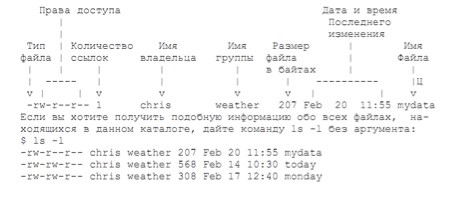

# Файловая система Linux
Структура основана на стандарте Unix Filesystem Hierarchy (иерархия файловой системы Unix). Все файлы организованы в каталоги, которые иерархически соединены друг с другом, образуя одну общую файловую структуру - древовидную или "родители-потомки". Над файлами и каталогами можно выполнять различные действия: копирования, перемещения, поиска или создания ссылок (ярлыков).

Вверху файловой системы находится **корневой каталог** (обозначается символом "косая черта"), от которого ответвляются другие каталоги. Каждый каталог может содержать несколько других каталогов или файлов, но родительский каталог у него всегда бывает только один. В корневом каталоге имеется несколько **системных каталогов**, которые содержат файлы и программы, относящиеся к самой ОС Linux.

В корневом каталоге содержится:
- `/bin` (двоичные файлы) хранятся двоичные файлы Linux; большинство основных команд Unix находятся в этом каталоге.
- `/sbin` (системные двоичные файлы) содержит системные двоичные файлы, которые являются утилитами для администрирования (например, `fdisk`).
- `/boot` (или `efi`) содержит файлы загрузчика Linux.
- `/dev` (устройства) содержит драйверы устройств, которые используются для доступа к устройствам и ресурсам системы, таким как диски, модемы, память и т.д. Например, вы можете читать входные сигналы от мыши, имея доступ к `/dev/mouse`. Устройства, чьи имена начинаются на `/dev/pty`, это "псевдотерминалы". Они используются для входа с удаленных "терминалов". Например, если ваша машина в сети, вход к вам по telnet будет использовать одно из устройств `/dev/pty`.
- `/sys` похож на `/dev` и содержит конфигурации устройств и драйверов.
- `/etc` (другое) содержит все файлы системы администрирования.
- `/etc/passwd` информация обо всех пользователях в ОС.
- `/etc/group` список всех групп, созданных в ОС.
- `/etc/shadow` все учетные данные пользователей.
- `/etc/hostname` название комьютера, использовать для редактирования.
- `/etc/hosts` статические записи DNS внутри хоста.
- `/etc/issue` информация об ОС.
- `/etc/apt/sources.list` файл конфигурации.
- `/etc/network/interfaces` информация о сетевых интерфейсах.
- `/lib` (библиотеки) содержит общие библиотеки для двоичных файлов внутри `/bin` и `/sbin`. Эти файлы содержат код, который могут использовать многие программы. 
- `/proc` (процессы) хранятся файлы с информацией о процессах и ядре. файлы хранятся в памяти, а не на диске.
- `/proc/cpuinfo` информация о процессоре.
- `/proc/meminfo` информация об ОЗУ.
- `/lost+found`, как следует из названия, содержит файлы, которые были восстановлены.
- `/mnt` (монтировать) содержит примонтированные каталоги (например, удаленный файловый ресурс).
- `/media` содержит каталоги, смонтированные для съемных носителей (например, DVD).
- `/opt` (опции) служит для установки дополнительных программных пакетов.
- `/tmp` (временная) используется временно; содержимое стирается после каждой перезагрузки.
- `/usr` (пользователь) содержит множество подкаталогов, необходимые для нормального функционирования системы.
- `/usr/share` хранит инструменты, файлы словарей.
- `/home` является главным для пользователей.
- `/root` является главным каталогом пользователя root.
- `/srv` (обслуживание) содержит некоторые данные, относящиеся к функциям системного сервера (например, данные для FTP-серверов).
- `/var` (переменная) хранятся переменные данные для баз данных, журналов и сайтов. Например, `/var/www/html/` содержит файлы для веб-сервера Apache.
- `/run` (время выполнения) содержит данные системы выполнения (например, пользователей, вошедших в систему в данный момент).

Корневой каталог, кроме того, содержит каталог `home`, который может содержать домашние каталоги всех пользователей системы. **Домашний каталог** каждого пользователя, в свою очередь, будет включать в себя каталоги, который пользователь создает для своих нужд. **Рабочий каталог** - тот, в котором вы в данный момент работаете в командной строке. При регистрации в системе в качестве рабочего принимается ваш домашний каталог, имя которого обычно совпадает с именем пользователя.

## Cсылки между файлами
В Linux существует два вида ссылок на файлы - символические и жёсткие. **Символические** похожи на привычные ярлыки, при нажатии на которые открывают целевой файл или папку. Могут ссылаться на другие разделы диска, но содержат только имя файла, а не его содержимое. Если файл удалён, то ссылка будет существовать и указывать в никуда. **Жёсткие** ссылки тоже указывают на файлы, но работают только в пределах одной файловой системы, не могут ссылаться на каталоги, позволяют перемещать и переименовывать файл без вреда для ссылки. 

## Путевые имена
Имя, которое дается каталогу или файлу при его создании, не является полным. **Полным именем** каталога является его путевое имя. Иерархические связи, существующие между каталогами, образуют пути, и эти пути можно использовать для однозначного указания каталога или файла и обращения к нему.

Путевые имена могут быть абсолютными и относительными. **Абсолютное путевое имя** - это полное имя файла или каталога, начинающееся символом корневого каталога. **Относительное путевое имя** начинается символом рабочего каталога и представляет собой обозначение пути к файлу относительно вашего рабочего каталога. Как правило, относительные путевые имена нужно использовать при каждой возможности, а абсолютные - только в случае необходимости.

При создании каталога в нем сразу же делаются две записи. Одна из них будет представлена точкой (.), а вторая - двумя точками (..). Точка обозначает путевое имя данного каталога, а две точки - путевое имя его родительского каталога.
Например, если letters - рабочий каталог и нужно скопировать в него файл weather, то каталог chris (родительский) можно обозначить двумя точками, а каталог letters - одной: `ср ../weather .`

## Права доступа
У каждого файла есть уникальное имя, по которому к нему можно обращаться, и конечный набор операций, которые процессы могут выполнять в отношении этого объекта - read (чтение), write (запись) и execute (выполнение). **Права доступа** означают разрешение на выполнение операции. 

Когда пользователь входит в систему, его оболочка получает UID и GID (UID – идентификатор пользователя, GID - идентификатор группы), которые содержатся в его записи в файле паролей, и они наследуются всеми его дочерними процессами. 
- **SUID (Set User ID)** - атрибут исполняемого файла, позволяющий запустить его с правами владельца, не зависимо от того - кто запускает эту программу.
- **SGID (Set Group ID)** аналогичен SUID, но относиться к группе. При этом, если для каталога установлен бит SGID, то создаваемые в нем объекты будут получать группу владельца каталога, а не пользователя.

Права доступа состоят из трех троек символов. Первая тройка представляет права владельца файла, вторая представляет права группы файла и третья права всех остальных пользователей.

