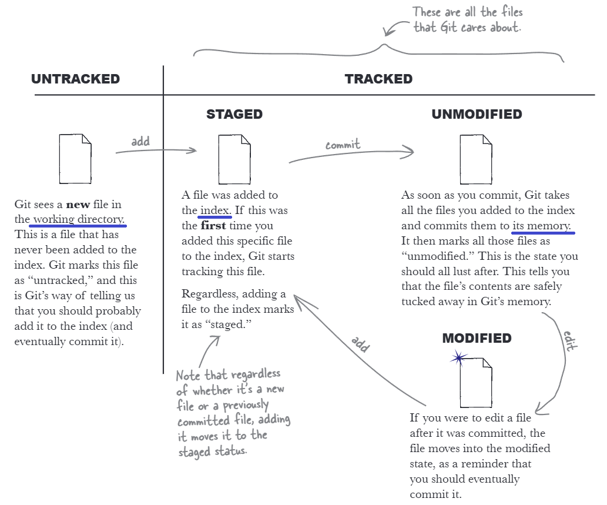

# git
- [git](#git)
  - [Введение](#введение)
  - [Состояния файлов](#состояния-файлов)
  - [Ветки](#ветки)
  - [Слияние веток](#слияние-веток)
  - [Различия коммитов](#различия-коммитов)
  - [Отмена изменений](#отмена-изменений)
  - [Командная работа](#командная-работа)
  - [Поиск по репозиторию](#поиск-по-репозиторию)
  - [Файл конфигурации гита](#файл-конфигурации-гита)
  - [Прочее](#прочее)
- [Моё пространство](#моё-пространство)

## Введение
**Git** - распределённая система управления версиями. Гит позволяет создавать разные версии программы, которые можно развивать самостоятельно, либо соединять с основной версией.

Папка со всеми файлами (версиями кода) называется **репозиторием** (repository). Когда добавляется изменение в файл, новая версия называется **коммитом** (commit). У каждого такого коммита есть своё имя, к которому можно обращаться, и при необходимости возвращать программу до предыдущих версий в случае неожиданной ошибки. Существуют **ветки** (branch), на которых расположены разные коммиты. Главная ветка называется `master` или `main`, она является "стволом" и основной частью всего кода программы. От неё могут идти другие ветки с разными названиями. Ветки и коммиты можно визуально представить в виде графа.

После установки Git следует указать имя и почту:
``` bash
git config --global user.name "John Doe"
git config --global user.email johndoe@example.com
# указать редактор nano вместо vi
git config --global core.editor "nano"
# запретить экранировать символы, выходящие за пределы стандартной латиницы (ASCII), чтобы корректно отображать русские названия файлов во всех командах
git config --global core.quotepath false
```

- `git init` инициализация нового репозитория
- `git add file_name` добавить файл в гит
- `git commit -m "commit_name"` зафиксировать файл с пояснением

Репозиторий Git разделен на 2 части: **индекс** и **объектная база данных**.
- `git add` помещает файл в индекс (место для временного хранения изменений)
- `git commit` сохраняет файл в объектной базе данных (банк памяти git)

## Состояния файлов


- Неотслеживаемые (**Untracked**).
- Отслеживаемые (**Tracked**): Индексированный (**Staged**), Неизмененный (**Unmodified**), Изменённый (**Modified**).

С помощью команд `git status` и `git add -i` можно узнать о состояниях файлов. Стоит упомянуть, что когда вы добавляете в индекс новую копию того же файла, Git заменяет старую копию новой. Игнорирование файлов достигается с помощью перечисления их в файл `.gitignore`.

Каждый последующий коммит ссылается на предыдущий (потомки ссылаются на родителей, а не наоборот). От чего **история коммитов** называется направленным ациклическим графом (directed acyclic graph, DAG).

## Ветки
На самом деле **ветка** - ссылка на коммит по его ID. Эта ссылка обновляется всякий раз, когда вы делаете новый коммит.
- `git branch` отображение списка веток
  - `git branch my-first-branch` создание новой ветки
  - `git branch -vv` подробная информация по веткам
  - `git branch -a` список всех веток, включая ветки слежения
  - `git branch -v` узнать идентификатор коммита
  - `git branch -d old-branch` удалить ветку
  - `git branch -D old-branch` принудительно удалить ветку (например, обособленную)
  - `git branch name_branch ID_commit` явно указать ID коммита, на котором должна быть основана ветка
- `git switch -c my-first-branch` создание новой ветки и переход на неё
- `git switch my-first-branch` переключение на другую ветку (более старая команда `git checkout`)

Каждый раз, когда вы переключаете ветки, Git переписывает рабочий каталог, чтобы он выглядел так, как будто вы сделали последний коммит в ветке, на которую только что переключились.

## Слияние веток
Основную ветку, в которой соединяют ветки, называют **интеграционной**, а остальные - **функциональными** или рабочими. 
- `git merge my-second-branch` слить ветку my-second-branch с той, в которой находимся
- состояние `fast-forward` (ускоренная перемотка) - доведение интеграционной ветки до состояния другого коммита.
- есть разница какую ветку с чем сливать, а именно - изменений не произойдёт, если мы производную ветку скрестим с той, на которой она основана. 
- состояние `recursive strategy` () - когда у нас есть две ветки, разветвленные от основной, мы можем соединить их в единую, добавив файлы "в кучу".
- при клонировании репозитория создаётся ветка `origin/master`, которая называется веткой слежения за удалённым репозиторием. эти ветки нельзя изменять, они предназначены для управления гитом. 

**Конфликты** возникают тогда, когда при слиянии на разных ветках был изменён один и тот же файл. в таком случае git выведет ошибку и укажет на изменения внутри самого файла. для решения проблемы можно: отменить изменения в первой ветке, оставить изменения первой ветки, оставить оба изменения, отменить оба изменения. после этого нужно снова добавить файл в гит и сделать коммит.
- `git merge --squash develop` сделать слияние ветки develop в режиме squash (без авто-коммита)
- `git merge --squash develop --allow-unrelated-histories` принудительно слить ветки, у которых нет ни одного общего предка (unrelated histories)
- `git checkout --theirs .` принять все файлы из ветки develop для конфликтных мест

Существует команда `git rebase`, которая в отличие от `merge` переписывает историю коммитов, делая её идеально прямой. Происходит это таким образом: берет коммиты из рабочей ветки, временно откладывает их в сторону, обновляет ветку до самого свежего состояния `main`, а затем по очереди применяет (копирует) коммиты сверху. Следует использовать `rebase` только для обновления локальных приватных веток свежим кодом из `main` перед отправкой пул-реквеста ради сохранения чистоты истории, полностью исключив его применение для общих удаленных веток (`main` или `develop`), над которыми работают другие участники команды.

## Различия коммитов
- `git log` выводит список коммитов в ветке
  - `git log --oneline` выведет список коммитов с кратким описанием (этот флаг объединяет в себе другие: `--pretty=oneline --abbrev-commit`)
  - `git log --oneline --all --graph` - список коммитов на всех ветках в виде графа
- `git diff file1` покажет построчные изменения между файлом в индексе и в рабочем каталоге 
  - `git diff --word-diff file1` покажет изменения, выделяя слова, а не целые строки
  - `git diff --cached file1` сравнивает содержимое в базе данных объектов с индексом (аналог флаг `--staged`)
  - `git diff branch1 branch2` сравнивает последние коммиты двух веток
- `git cherry-pick` перемещает коммиты из одной ветки в другую

Рекомендуется иметь коммиты с заголовком и телом, например:
``` console
feat: обновить имена стилей CSS

- выровнять имена и описания всех классов CSS
```

[**Эта статья на хабре**](https://habr.com/ru/articles/867012/) является хорошей шпаргалкой по стандарту **Conventional Commits**, описывающему оформление коммитов. Некоторые типы коммитов:
- `feat:` при представлении новой функции или улучшения
- `fix:` при исправлении ошибок
- `docs:` при внесении исправлений в документацию
- `chore:` при изменениях, затрагивающих инструменты, такие как Git
- `test:` добавляете или модифицируете тесты

## Отмена изменений
- `git restore file` восстановление файла в рабочем каталоге до версии в индексе (обратное действие `git add`)
  - `git restore --staged file` восстанавливает файл после коммита из объектной базы (обратное действие `git commit`)
  - `git restore --source=branch .` полный перенос из одной ветки в другую файлов
- `git rm file` удаление отслеживаемого файла из рабочего каталога и индекса (объектную базу не трогает,  чтобы случайно не прервать цепочку коммитов)
  - `git rm -r name-dir` удаление каталога вместе с внутренними файлами
  - `git rm --cached file` прекратить отслеживание файла, но при этом физически оставить в рабочем каталоге
- `git mv file-a file-b` переименование и перемещение файла в рабочем каталоге и индексе
- `git commit --amend -m "commit text"` переименование последнего коммита (важно, чтобы рабочий каталог был чистым и без изменений)
- `git branch -m branch1 branch2` переименование ветки (если требуется переименовать ветку, в которой находишься, достаточно указать 1 аргумент)
- `git reset HEAD~1` удаление последнего коммита путем перемещения к предыдущему
  - `git reset --soft HEAD~1` перемещает файлы из объектной базы в индекс и рабочий каталог
  - `git reset --mixed HEAD~1` изменяет и объектную базу, и индекс, сохраняя всё в рабочий каталог  (параметр по умолчанию)
  - `git reset --hard HEAD~1` перезаписывает объектную базу, индекс и рабочий каталог до предыдущего коммита
  - `git reset --hard origin/main`
- `git revert HEAD` делает инверсию действий последнего коммита (возвращает удалённые строки, удаляет новые); создаёт новый "антикоммит"

Метка **HEAD** служит ориентиром, в каком месте находится пользователь, а именно ссылается на последний коммит в ветке. Так же **HEAD** указывает на родителя следующих коммитов. Таким образом метку можно использовать для:
- `git diff HEAD~1 HEAD` сравнение коммитов (`HEAD~n`, где n - на сколько коммитов спуститься вниз)
- `git diff HEAD^1~1 HEAD` сравнение коммитов при слиянии веток (где ^1 - основная ветка, ^2 - дополняющая; комбинация позволяет ссылать не только на родителя, но и на "дедушку")

## Командная работа
- `git clone https://github.com/user/repo.git` клонирование репозитория с удалённого сервера
- `git push` (=`git push origin`) отправка коммита на удалённый сервер
- `git push --set-upstream origin second-branch` отправить рабочую ветку
- `git config --global push.default simple` (по умолчанию) безопасная настройка
- `git remote -v` расположение удалённого репозитория

`pull request` - запрос на слияние - используется для совместной работы. Участники проекта могут смотреть вносимые изменения, обсуждать их и только после `merge pull request` они уйдут в основную ветку.

- `git pull` проверяет новые коммиты на удалённом репозитории для конкректной ветки и выгружает их (`git fetch` + `git merge ветка-слежения`)
- `git fetch` обновляет и выгружает все ветки слежения с удалённого репозитория
- процесс удаления рабочих веток: 
  - например, после слияния с основной удаляем с удаленного репозитория ветку, 
  - локально смотрим изменения `git fetch -p`, 
  - удаляем локально ветку `git branch -D feat-a`, 
  - догоняем изменения основной ветки `git merge origin/main`, 
  - смотрим граф коммитов `git log --graph --oneline --all`

## Поиск по репозиторию
- `git blame file` показывает последние изменения файла с коммитами
  - `git blame -s file` скрыть автора и дату коммита
  - `git blame <ID> file` подать ID коммита, чтобы посмотреть изменения на тот момент
- `git grep word` ищет слово или фразу в остлеживаемых файлах
  - `-i` : игнорировать регистр
  - `-n` : показывать номера строк
  - `-l` : показать только список файлов
- `git log -S word` ищет точное совпадение строки, только если эта строка была добавлена с нуля или полностью удалена, т.е. изменилось количество
  - `git log -S word file` искать только в пределах одного файла
  - `git log -G word` ищет изменения с помощью регулярных выражений, если строка была любым образом изменена
  - `git log -p` покажет фактические изменения, которые внесли коммиты (пример: `git log -p --oneline -S word --word-diff`)
  - `git log --grep "words"` ищет коммиты с указанным описанием
  - `git checkout <ID>` зайти на конкретный коммит (рекомендуется проводить подобное на отдельных ветках)

**`git bisect`** — это режим автоматического поиска коммита, который внёс баг/опечатку, методом бинарного поиска (деления истории пополам). этапы:
  - `git bisect start` запускает режим поиска бага и очищает историю для разметки.
  - `git bisect bad` помечает текущий коммит (или указанный) как «плохой», то есть содержащий ошибку.
  - `git bisect good <ID>`
  - `cat appetizers.md` выводит содержимое файла на экран, чтобы могли проверить, присутствует ли в нём опечатка.
  - `git bisect good` помечает текущий проверенный коммит как «хороший», подтверждая, что в нём опечатки ещё нет.
  - `git bisect reset` завершает процесс поиска и возвращает на исходную ветку, в которой находились до начала тестирования.

## Файл конфигурации гита
Внутри репозитория лежит файл `.git/config`. Параметры гита можно менять как глобально (флаг `--global`), так и локально (флаг `--local`), и в рамках одного репозитория локальные настройки выше. Для того, чтобы убрать запись используется флаг `--unset`, например, локально убрать запись о почте `git config --local --unset user.email`.
- `git config --list --show-origin` просмотреть список параметров с указанием глобальных и локальных настроек
- `git config --global alias.loga "log --oneline --graph --all"` назначить псевдоним (теперь можно вызвать просто `git loga`)

Перечисление файлов и каталогов в файл `.gitignore` позволяют не заливать ненужные системные, временные или конфиденциальные данные. можно настроить глобально: `git config --global core.excludesfile ~/.gitignore_global`

## Прочее
**Теги**, как и ветки, также являются ссылками на коммиты, при этом они никогда не перемещаются. Их используются для ориентиров в истории проектов, например, обозначив определенную версию программного обеспечения. Команды `fetch`, `push` и `pull` поддерживают флаг `--tags`.
- `git tag v1.0.0`
- `git tag v1.0.0 049896f` с указанием ID коммита
- `git tag -l` показать список тегов

**Тайники** прячат изменения в стек в рабочем каталоге для того, чтобы была возможность переместиться на другую ветку и вернуть их.
- `git stash` прячет изменения
- `git stash pop --index` получает все изменения в последнем тайнике и возвращает их

**Журнал перемещения указателя HEAD** можно просмотреть командой `git reflog`.

# Моё пространство
Этот репозиторий имеет две ветки на моём компьютере. `main` является публичной, финальной версией моих конспектов. `develop` является приватной, в ней я храню черновики и наброски заметок. Для того, чтобы таким образом организовать пространство, нам потребуется иметь два репозитория на гитхабе, так как отдельно нельзя настроить ветки.

Рекомендую сгенерировать и добавить SSH ключ на GitHub для удобства авторизации. Далее на сайте GitHub создайте два репозитория, например, `linux-enjoyer` - публичный и `linux-enjoyer-develop` - приватный. Локально проходимся по следующим шагам:
1. `mkdir linux-enjoyer; cd linux-enjoyer` создаём репозиторий и переходим в него;
2. `git init` инициализируем репозиторий;
3. `git branch -M main` создаём основную ветку `main`, которая будет заливаться на публичный репо;
4. `touch README.md` создаём файл;
5. `git add README.md` делаем его отслеживаемым;
6. `git commit -m "init repo"` делаем коммит;
7. `git remote add origin git@github.com:user/linux-enjoyer.git` указываем публичный репозиторий под именем `origin` (**user** меняем на свой ник на гитхаб);
8. `git remote add origin-private git@github.com:user/linux-enjoyer-develop.git` указываем приватный репозиторий под именем `origin-private`;
9. `git branch` проверить на какой ветке находимся;
10. `git push -u origin main` отправить ветку `main` в публичный репозиторий `origin`;
11. `git switch -c develop` создаём и переключаемся на ветку `develop`, которая будет видна только нам;
12. `echo "# Черновики" > README.md` изменяем файл;
13. `git add README.md; git commit -m "init drafts"` фиксируем изменения;
14. `git push -u origin-private develop` отправляем ветку `develop` в приватный репозиторий `origin-private`;
15. `git branch -vv` проверить ветки.

Вывод команды `git branch -vv` представлен ниже. Тоже самое можно проверить на сайте GitHub. Теперь ветки будут пушиться в разные места, при этом их удобно локально сливать и следить за изменениями.
``` 
* develop 937429d [origin-private/develop] init drafts
  main    dde68a4 [origin/main] init repo
```
