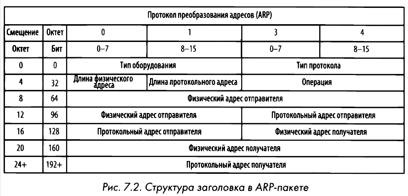
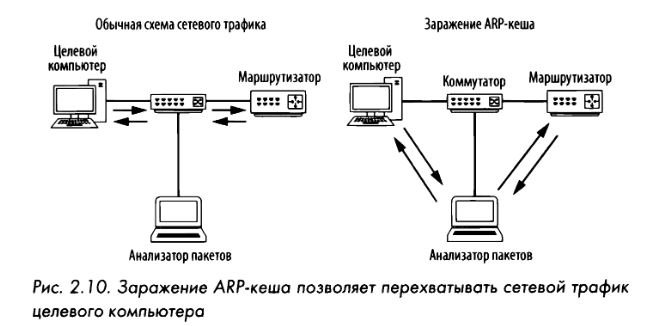

# ARP
Address Resolution Protocol или **Протокол разрешения адресов** — механизм, который сопоставляет адреса [**IPv4-адреса**](ipv4.md) с MAC-адресами для взаимодействий протоколов 2 и 3 уровня [**модели OSI**](osi--tcp-ip.md). Протокол определен в стандарте [**RFC 826**](https://www.ietf.org/rfc/rfc826.txt).

В Linux с помощью команды `arp -a` можно получить список элементов внутри таблицы ARP, сохраненной локально на хосте.
Команда `arp-scan [ip-адрес/маска]` выведет список всех хостов в одной сети. 

В процессе преобразования адресов по протоколу ARP применяются только два типа пакетов: АRР-запрос и АRР-ответ. АRР-запрос посылается в [**широковещательном**](net-trffc.md) режиме. Если по сети передается **самообращенный АRР-пакет**, то он вынуждает любое принимающее его устройство обновить кеш-память. Этот пакет похож на ARP-запрос с той разницей, что отправитель и получатель один и тот же хост. Многие [**сетевые устройства**](net-equip.md) сохраняют в памяти МАС адреса устройств, с которыми обменивались данными, то есть создается таблица ассоциативной памяти, которая динамически обновляется.

## Заражение ARP
Отравление ARP происходит, когда злоумышленник отправляет поддельные ARP-сообщения с целью связать свой MAC-адрес с IP-адресом целевого устройства. Это может привести к атакам типа **"Человек посередине" (MITM)**, при которых злоумышленник может перехватывать, изменять или блокировать трафик, предназначенный для целевого устройства. Для предотвращения атак с отравлением ARP организации могут внедрять меры безопасности: статические записи ARP, динамическая проверка ARP и обеспечение обновления сетевых устройств.

