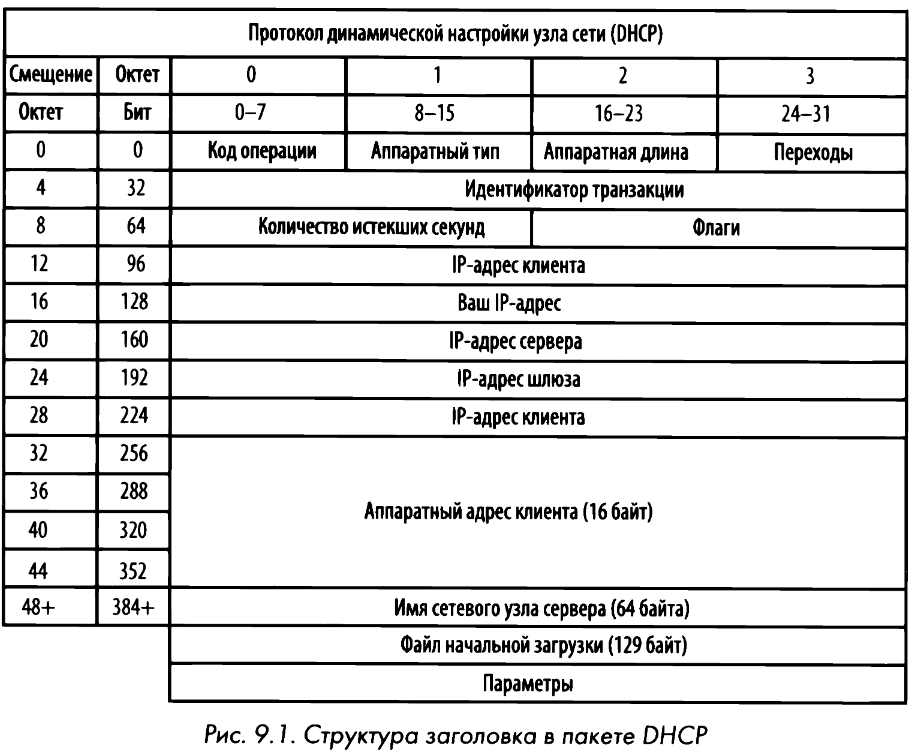
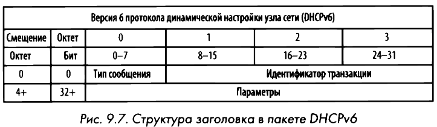

# DHCP
**Dynamic Host Configuration Protocol** или **Протокол динамической настройки узла сети** отвечает за возможность хосту автоматически получать не только свой IP-адрес, но и адреса других сетевых ресурсов (DNS-сервера, маршрутизатора). В прошлом **ВООТР** (Bootstrap Protocol - протокол начальной самозагрузки) был предназначен для автоматического присваивания адресов устройствам, подключаемым к сети. Впоследствии протокол был заменен более развитым DHCP.

Процесс инициализации нередко называют процессом **DORA**:
- **Discover** (Обнаружение). Пакет 0.0.0.0 через порт 68 отправляется по широковещательному адресу 255.255.255.255 на порт 67 через [**UDP**](udp.md).
- **Offer** (Предложение). Сервер отправляет пакет на адрес, который будет предложен клиенту. На самом деле у клиента пока еще нет адреса, поэтому сервер попытается сначала связаться, используя аппаратный адрес по протоколу ARP. 
- **Request** (Запрос). Пакет по-прежнему поступает из сетевого узла с IР-адресом 0.0.0.0, поскольку процесс получения IР-адреса еще не завершен. Данный пакет подобен пакету обнаружения в том отношении, что вся содержащаяся в нем информация об IР-адресах обнуляется. В поле DHCP Server ldentifier содержится IР-адрес сервера.
- **Acknowledgment** (Подтверждение). Сервер посылает клиенту запрашиваемые IР-адреса в пакете подтверждения, записывая эту информацию в своей базе данных. 

Когда **срок аренды адреса** подходит к концу, клиенту и серверу достаточно обменяться Request/Acknowledgment пакетами для возобновления.

Злоумышленники могут использовать DHCP, устанавливая в сети мошеннические DHCP-серверы, проводя атаки типа "человек посередине" **(Man-in-the-Middle, MITM)** или даже атаки типа "отказ в обслуживании" **(Denial of Service, DoS)**.
# DHCPv6
Стандарт [**RFC 3315**](https://www.ietf.org/rfc/rfc3315.txt). Поскольку версия DHCPv6 не построена по принципу протокола ВООТР, то структура заголовка становится проще:

Вместо DORA происходит **SARR**:
- **Solicit** (Опрос). Клиент посылает пакет по многоадресатному адресу ([**ff02: :1:2**](ipv6.md)), чтобы попытаться обнаружить доступные DНСРv6-серверы.
- **Advertise** (Анонс). Доступный сервер отвечает непосредственно клиенту, что он доступен для предоставления сведений об адресах и конфигурации.
- **Request** (Запрос). Клиент посылает формальный запрос сведений о конфигурации доступному серверу.
- **Reply** (Ответ). Сервер посылает все имеющиеся сведения о конфигурации.
