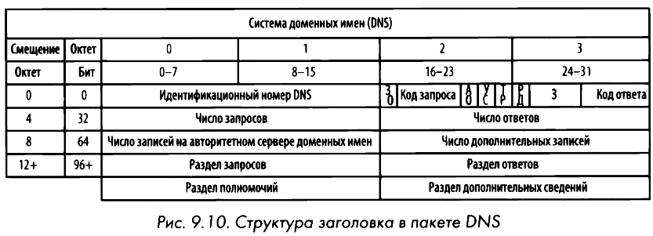

# DNS
Domain Name System или **Система доменных имен** переводит доменные имена в IP-адреса. Доменные имена делятся на **общедоступные** и **частные**. Любой, кто подключен к интернету, может получить доступ к сайту по общедоступному домену. Частные имена используются в локальный сетях, например, внутри Windows Active Directory.

Протокол DNS функционирует в режиме **"запрос-ответ"**. В частности, клиент, желающий преобразовать DNS-имя в IР-адрес, посылает запрос DNS-cepвepy, а тот - ответ с запрашиваемой информацией. DNS в качестве транспортного использует протокол [**UDP**](udp.md).

На **DNS-cepвepax** хранится база данных с записями ресурсов, содержащих сопоставления IР-адресов и доменных имен, которыми эти серверы делятся с клиентами и другими DNS-серверами. **В Linux** команда `host [доменное имя]` выдаёт IP-адрес. Добавить статическую запись DNS внутри хоста  можно в файле `/../etc/hosts`.
## Структура заголовка

- **Запрос/Ответ, ЗО (Query/Response, QR).** Обозначает, содержит ли пакет DNS-зaпpoc или DNS-ответ.
- **Авторитетный ответ, АО (Authoritative Answers, АА).** Если значение этого поля установлено в ответном пакете, это означает, что ответ поступил от авторитетного сервера доменных имен, обслуживающего данный домен.
- **Усечение, УС (Truncation, ТС).** Обозначает, что ответ был усечен, поскольку он оказался слишком большим и не поместился в пакет.
- **Рекурсия доступна, РД (Recursion AvailaЫe, RA).** Если значение этого поля установлено в ответе, это означает, что рекурсивные запросы поддерживаются на сервере доменных имен.
- **Зарезервировано, З (Reserved, Z).** По стандарту RFC 1035 в этом поле должны быть установлены все нули. Но оно иногда используется в качестве расширения поля RCode.
- **Код ответа (Response Code, RCode).** Служит в DNS-ответах для указания на наличие любых ошибок.
## Наиболее употребительные типы записей ресурсов

| Значение | Тип | Описание |
|----------|-----|----------|
| 1 | A | IPv4-адрес хоста |
| 2 | NS | Авторитетный сервер доменных имён |
| 5 | CNAME | Каноническое имя псевдонима |
| 15 | MX | Обмен почтой |
| 16 | TXT | Текстовая строка |
| 28 | AAAA | IPv6-адрес хоста |
| 251 | IXFR | Инкрементный перенос зоны |
| 252 | AXFR | Полный перенос зоны |

## Рекурсия
В силу иерархического характера межсетевой структуры DNS все DNS-cepвepы должны быть в состоянии связываться друг с другом, чтобы получать ответы на запросы клиентов. Когда одному DNS-cepвepy требуется найти IР-адрес, он запрашивает другой DNS-cepвep от имени клиента, делающего первоначальный запрос. Этот процесс называется **рекурсией**. 

Подобные серверы установлены в локальных сетях и у некоторых провайдерах. Все остальные серверы **нерекурсивные**. Если компьютер отправит запрос на сервер и сервер не имеет информацию по данному запросу, то сервер в качестве ответа вернет компьютеру IP адрес другого сервера, который возможно имеет некую информацию. Компьютеру придется делать запрос на другой сервер и так до тех пор, пока не получит требуемую информацию.
# Передача зоны DNS
**DNS-зoнa** - это пространство имен (или группа), вести которое поручено DNS-серверу. Как правило, дополнительные DNS-серверы вводятся для разделением ответственности между субдоменами (почты, веба, БД). 

Копирование записей главного сервера на другой подчиненный сервер DNS называется **передачей зоны DNS**. Для передачи (переноса) зоны используется протокол [**TCP**](tcp.md). Например, системные администраторы таким образом могут настроить вспомогательный DNS-cepвep на случай отказа работы основного сервера. В свою очередь злоумышленники могут воспользоваться этим, найдя домен главного сервера DNS (NS-сервер). Запрос ниже срабатывает редко:
1. Сначала получим список серверов ns для случайного доменного имени:
	`host -t ns google.com | cut -d " " -f 4`
2. Пробуем запросить сервер ns1 с помощью команды `host -l`:
	`host -l google.com ns1.google.com`

Имеются следующие виды переноса зон:
- **Полный перенос зоны (AXFR)**, при которых вся зона пересылается между устройствами.
- **Инкрементный перенос зоны (IXFR)**, при которых пересылается лишь часть данных зоны.
# DNS Brute-Force
Поиск доменных имен **методом грубой силы** позволяет находить скрытые поддомены. С помощью [**простенького bash-скрипта**](../etc/dns-brute-force.sh) и команды `host` можно перебрать домены из заготовленного файла (словаря).

Помимо этого существуют готовые решения:
- `fierce -dns [доменное имя]`
- `python sublist3r.py [доменное имя]`
- `python subbrute.py [доменное имя]`

Главное, чтобы инструменты:
1. Осуществляли быстрый перебор на основе файла словаря;
2. Проверяли возможность передачи зоны DNS;
3. Автоматизировали поиск в поисковых системах.

## Утилиты nslookup и dig
`nslookup` - инструмент командной строки сетевого администрирования, предназначенный для получения информации о записях системы доменных имен.

`dig` (Domain Information Groper) представляет собой инструмент командной строки, используемый для выполнения DNS-запросов и получения ценной информации о доменах, IP-адресах и записях DNS.