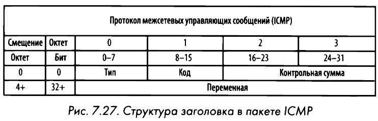

# ICMP
Internet Control Message Protocol или **Протокол межсетевых управляющих сообщений** служит для проверки доступности устройств, служб или маршрутизаторов в сети ТСР/IP. Определен в стандарте [**RFC 792**](https://www.ietf.org/rfc/rfc792.txt). Протокол ICMP является частью протокола IP и использует его для передачи сообщений. 

Инструмент [**ping**](ping.md) использует протокол ICMP. Отправляет эхо-запрос в ожидании эхо-ответа. При этом современные брандмауэры накладывают ограничения на реагирование ICMP пакетов в целях безопасности, так как через поле произвольного текста можно помещать небольшие фрагменты данных для скрытной передачи по сети.
# ICMPv6
Описан в документе [**RFC 4443**](https://www.ietf.org/rfc/rfc4443.txt) и предназначен для поддержки ряда возможностей, требующихся для нормального функционирования протокола [**IPv6**](ipv6.md). Структура заголовка пакета такая же, как в пакетах ICMP.

В ICMPv6 применяется [**многоадресатный**](net-trffc.md) тип передачи данных, которые смогут получить и обработать только те хосты, которые подписаны на этот поток. Зарезервированное пространство IР-адресов `ff00::/8`. 