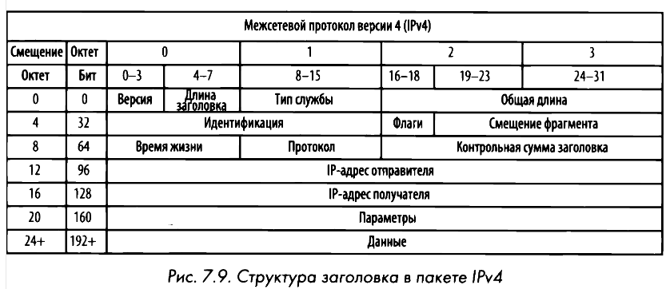
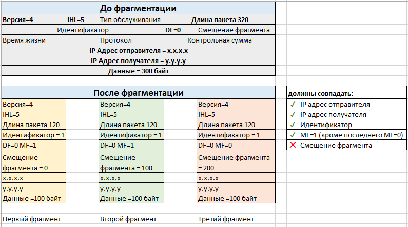

# IPv4
IPv4 является 32-битным, но для удобства представлен в десятичном формате. Четыре числа от 0 до 255 записываются через точку. Адрес состоит из 2 частей: номер сети и номер узла (хоста). Разделение происходит с помощью [**маски сети**](ip.md), ещё называемой **маски подсети**.

Хосты имеют **внутренние** и **внешние** (белые) IP-адреса. Внутренние используются для подключения к локальной сети, а внешние с глобальными сетями. IP-адреса могут быть **статическими** (их устанавливает пользователь), либо **динамическими**, которые автоматически выдаются DHCP-сервером.

**Диапазоны частных адресов IPv4:**
- класс A — 10.0.0.0 — 10.255.255.255;
- класс B — 172.16.0.0 — 172.31.255.255;
- класс C — 192.168.0.0 — 192.168.255.255.

Класс A используется корпорациями, класс B предназначен для малых/средних/крупных компаний, а класс C подходит для домашних пользователей и малых/домашних офисов.

# Фрагментация
**Фрагментация пакетов** - это средство протокола IP, oбeспечивающее надежную доставку данных по разнотипным сетям путем разбиения потока данных на мелкие фрагменты. Фрагментация пакетов основывается на размере **максимального передаваемого блока (MTU, Maximum Transmission Unit)** для протокола второго канального уровня, а также конфигурации устройств, применяющих этот протокол. 

**Процесс фрагментации:**
- Деление данных на фрагменты;
- В поле общей длины (Total Length) каждого IР-заголовка задается размер сегмента для каждого фрагмента;
- Во всех пакетах, кроме последнего в потоке данных, устанавливается флаг Мoге fragments (Дополнительные фрагменты);
- В поле смещения фрагмента (Fragment offset) задается конкретное смещение для текущего фрагмента, которое он должен занимать в потоке данных.
- Далее пакеты передаются по сети.

Обычно **необходимость** во фрагментации **возникает на стыковке сетей с различными технологиями канального уровня**, например, Ethernet, ATM, FDDI, Token Ring  и так далее. Кадры данных технологий имеют различную длину, которая называется **MTU (Maximum Transmission Unit) - максимальный объем данных**, который может уместиться в одном кадре. Например, в Ethernet MTU равен 1500, в FDDI - 4096. Кадр FDDI не сможет поместиться в кадре Ethernet, поэтому на этот случай и предусмотрен механизм фрагментации пакетов на сетевом уровне.