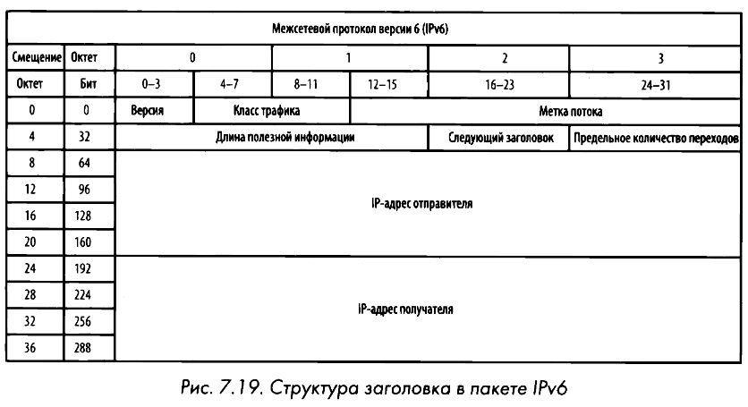

# IPv6
Адрес IPv6 состоит из 128 бит, что обеспечивает пространство в $2^{128}$ адресов. В IPv6 адреса принято записывать в шестнадцатеричной форме квартетами (8 групп по 2 байта), разделёнными двоеточием, например: `1111:0000:2222:0000:3333:4444:5555:6666`. IРv6-адрес также состоит из сетевой и узловой частей, которые могут называться **сетевым префиксом** (назначается провайдером) и **идентификатором интерфейса** (узлом) соответственно. Для идентификатора интерфейса может использоваться формат **EUI-64**, где в качестве узла указывается измененный MAC-адрес: между первой и второй половиной добавляются 2 байта FFFE, а 7-ой бит 1-го байта устанавливается в 1.

Сетевой трафик по протоколу IPv6 разделяется на следующие [**категории**](net-trffc.md):
- **Одноадресатные (unicast)** — стандартные адреса, которые делятся на глобальные (публичный адрес от провайдера), локальные (аналог частных в IPv4) и канальные (link-local, используются для работы протокола NDP, назначаются автоматически и не маршрутизируются в интернете).
- **Многоадресатные (multicast)** — используются вместо широковещательных (broadcast) адресов, которые IPv6 не поддерживает; на запрос реагируют все устройства группы.
- **Резервные (anycast)** — групповой адрес, применяемый маршрутизаторами, где на запрос отвечает всегда ближайшее устройство.

В отличие от IPv4:
- упрощенный заголовок на 40 байтов;
- обязательное использование IPSec;
- нет необходимости в NAT;
- агрегирование (объединение) адресов по континентам и странам.

Адреса назначаются 5 региональным реестрам (RIR) агентством ICANN: ARIN (Северная Америка), RIPE NCC (Европа, Ближний Восток, Центральная Азия), APNIC (Азия, Тихоокеанский регион), AfriNIC (Африка) и LACNIC (Латинская Америка).

# NDP вместо ARP
В протоколе IPv6 широковещательный трафик не поддерживается, заменой является **опрос соседа (neighbor solicitation)** с помощью **протокола NDP** (Neighbor Discovery Protocol - протокол обнаружения соседей) и [**ICMPv6**](icmp.md) сообщений. Этот протокол берет на себя функции ARP и ICMP из IPv4: определяет префиксы подсети, шлюзы по умолчанию, соседей по локальной сети, разрешает адреса и выполняет автонастройку.

NDP поддерживает 5 типов пакетов ICMPv6:
1. Запрос на доступность маршрутизатора (Router solicitation), отправляемый по многоадресатному адресу FF02::2.
2. Ответ маршрутизатора (Router advertisement).
3. Запрос на доступность соседа (Neighbour solicitation) — ICMPv6 type 135.
4. Ответ соседа (Neighbour advertisement) — ICMPv6 type 136.
5. Перенаправление (Redirect).

Механизм обнаружения:
- Хост посылает пакет с сообщением Neighbor Solicitation (ICMPv6 type 135) через многоадресатную рассылку.
- В ответ получит пакет с сообщением Neighbor Advertisement (ICMPv6 type 136).
- Далее происходит передача данных в обычном режиме с эхо-запросами и ответами по протоколу ICMPv6.

# Фрагментация
IPv6 фрагментация используется в меньшей степени, поэтому параметры ее поддержки не включаются в заголовок IPv6. Предполагается, что устройство, передающее пакеты IPv6, должно сначала запустить процесс **поиска размера блока MTU**, чтобы определить максимальный размер отправляемых пакетов, прежде чем фактически отправить их. Если же маршрутизатор получит пакеты, которые оказываются слишком длинными и превышают размер блока MTU, то он отбросит их и возвратит сообщение **ICMPv6 Packet Тоo Big (type 2)**. Получив это сообщение, передающее устройство попытается снова послать пакет, но уже с меньшим блоком MTU, если только подобное действие поддерживается в протоколе верхнего уровня. Этот процесс будет повторяться до тех пор, пока не будет достигнут достаточно малый размер блока MTU или предел фрагментации полезной информации.

# Миграция и протоколы IPv6 поверх IPv4
Для плавного перехода и взаимодействия сетей применяются следующие технологии:
- **Двойной стек (Dual stack)** — все сетевые устройства работают одновременно на IPv4 и IPv6.
- **Туннелирование** — пакеты IPv6 инкапсулируются в пакеты IPv4 и передаются по сети IPv4, после чего извлекаются в сети назначения. Включает в себя вручную настроенные туннели (MCT) на конечных маршрутизаторах.
- **6to4** — позволяет передавать пакеты IPv6 через сеть IPv4 с поддержкой ретрансляторов и маршрутизаторов. Создается динамический туннель, конечная точка которого определяется путем добавления глобального IPv4-адреса в шестнадцатеричной форме к зарезервированному префиксу `2002::/16`.
- **Teredo** — применяется для одноадресатной передачи с использованием протокола NAT. Туннель создается конечными узлами: пакеты IPv6 инкапсулируются в пакеты UDP и посылаются через сеть IPv4.
- **ISATAP** — протокол внутрисайтовой автоматической туннельной адресации, допускающий обмен данными исключительно между IPv4- и IРv6-устройствами. Динамически создает туннель, но не работает при наличии преобразования NAT.
- **NAT-PT** — трансляция адресов IPv6 напрямую в адреса IPv4 для взаимодействия разных сетей друг с другом.