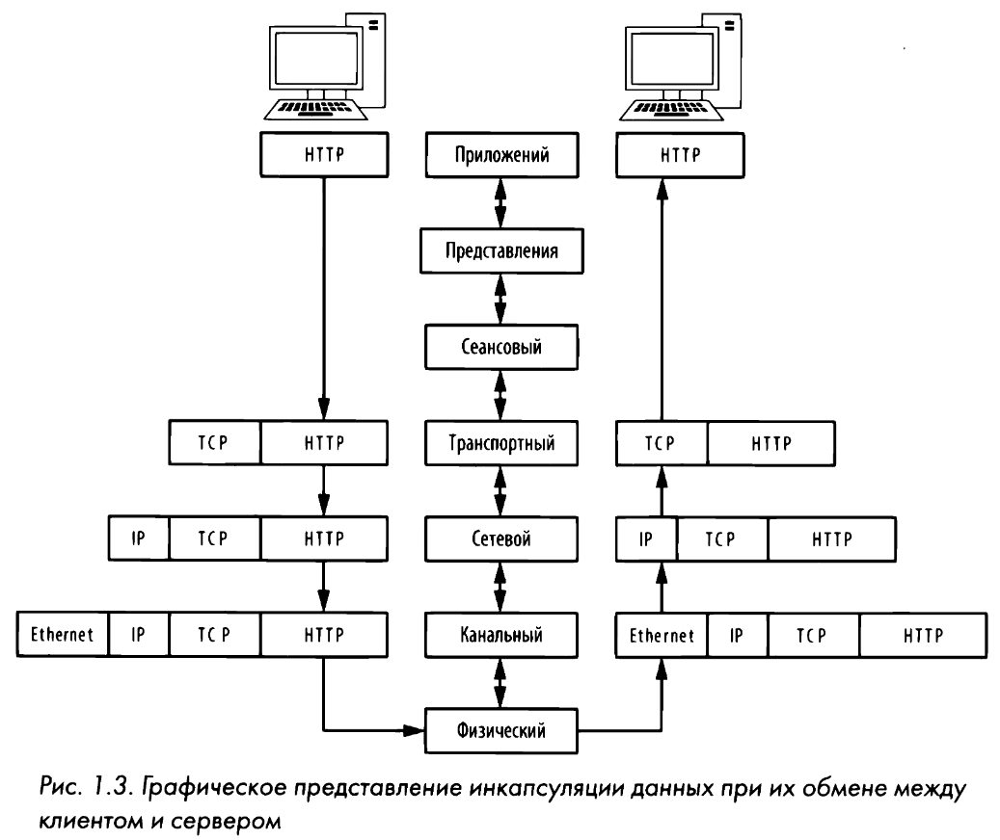

# Инкапсуляция
Протоколы, действующие на разных уровнях модели OSI, обмениваются данными посредством **инкапсуляции данных**. В процессе инкапсуляции создается **блок протокольных данных (PDU - protocol data unit)**, включающий в себя передаваемые данные и всю добавленную заголовочную и концевую информацию для взаимодействия между уровнями. 

# Уровни OSI
Иерархическая модель состоит из семи уровней и очень удобна для понимания особенностей связи и передачи данных по сети. В таблице приведены уровни, форма информации, примеры [**протоколов**](protocol.md) и [**сетевых устройств**](net-equip.md).

| УРОВЕНЬ | НАИМЕНОВАНИЕ | ИНФОРМАЦИЯ | ПРИМЕРЫ ПРОТОКОЛОВ | ПРИМЕРЫ УСТРОЙСТВ |
| :---: | :--- | :---: | :--- | :--- |
| 1 | Физический | Биты | Проводной или беспроводный | Кабели |
| 2 | Канальный | Фреймы | Ethernet, MAC, VLAN | Свитчи |
| 3 | Сетевой | Пакеты | IPv4/v6, ICMP | Роутеры |
| 4 | Транспортный | Сегменты | TCP, UDP | NA |
| 5 | Сеансовый | Данные | NetBIOS, SAP, SDP, NWLink | NA |
| 6 | Уровень представления | Данные | ASCII, MPEG, JPEG, MIDI | NA |
| 7 | Прикладной | Данные | FTP, HTTP, Telnet | Сетевые экраны, прокси и т. д. |

## Уровень приложений
На самом верхнем уровне предоставляются средства для доступа пользователей к сетевым ресурсам. Как правило, это единственный уровень, доступный конечным пользователям.
## Уровень представления данных
На этом уровне получаемые данные преобразуются в формат, удобный для их чтения на уровне приложений. Порядок кодирования и декодирования данных зависит от протокола. На уровне приложений может также использоваться несколько форм шифрования и дешифрования данных для их защиты.
## Сеансовый уровень 
Происходит диалог, или сеанс связи, между двумя компьютерами. Сеансовый уровень отвечает также за установление дуплексного (т.е. двунаправленного) или полудуплексного (т.е. однонаправленного) соединения, а также для корректного разрыва связи между двумя хостами.
## Транспортный уровень
Основное назначение - предоставить надежные транспортные услуги ниже лежащим уровням. Благодаря управлению потоком данных, их сегментации и десегментации, исправлению ошибок на транспортном уровне обеспечивается безошибочная доставка данных из одной точки сети в другую. На этом уровне и действуют брандмауэры и промежуточные, так называемые прокси-серверы.
## Сетевой уровень 
Обеспечивает маршрутизацию данных между физическими сетями и правильную адресацию сетевых узлов (например, по IР-адресу). На этом уровне происходит также разбиение потоков данных на более мелкие части, а иногда и обнаружение ошибок. Именно на этом уровне и действуют маршрутизаторы.
## Канальный уровень
Основное назначение - предоставить схему адресации для обозначения физических устройств (например, МАС-адреса). На этом уровне и действуют такие физические устройства, как мосты и коммутаторы. 
## Физический уровень
Самый нижний уровень, где находится среда, по которой переносятся сетевые данные. На этом уровне определяется физические и электрические характеристики всего сетевого оборудования, предоставляются средства для совместного использования общих сетевых ресурсов и преобразования сигналов из цифровой в аналоговую форму, и наоборот.
