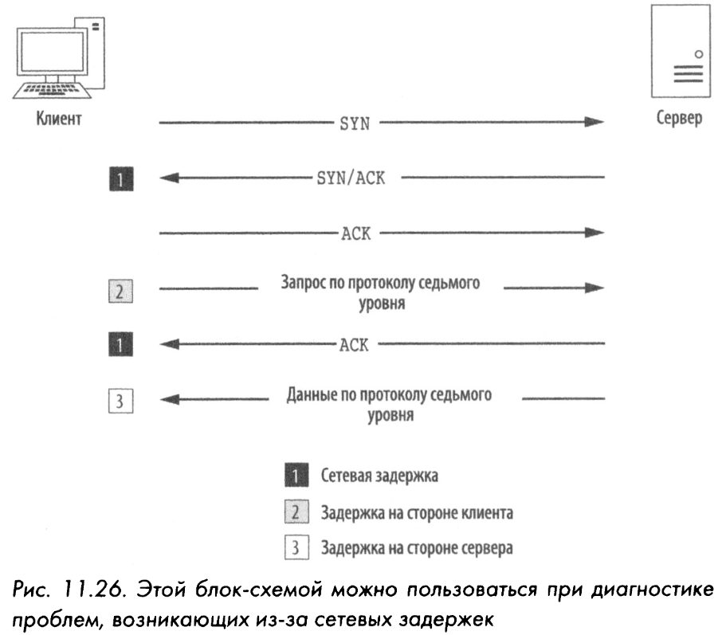
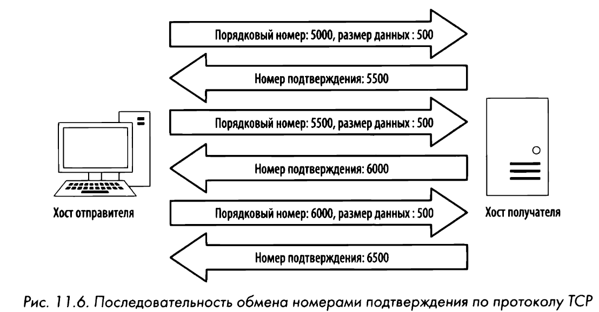
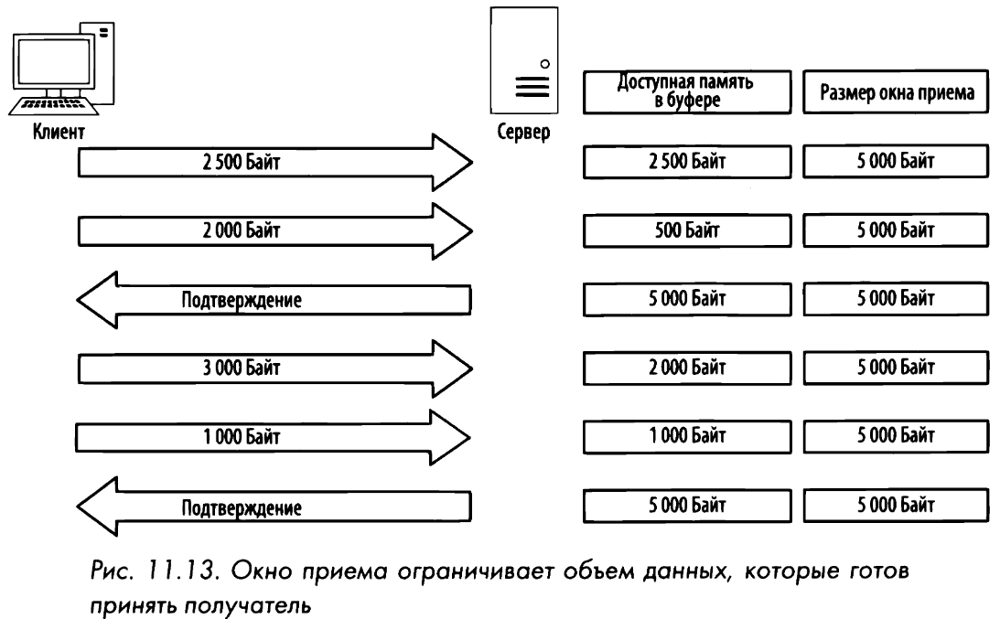

# Элементы управления потоком и надёжностью по протоколу TCP
## Задержки
Средства устранения ошибок лучше всего подходят для обнаружения, диагностики и в конечном счете уменьшения задержек при передаче данных в сети. **Задержка** - мера, определяющая разность между моментами времени передачи и приема пакетов. Задержки бывают **односторонние** (измеряется время передачи пакетов от отправителя к получателю) и **двухсторонние** (измеряется время передачи пакетов от отправителя к получателю и обратно к отправителю). 

К числу самых эффективных способов, позволяющих обнаружить источник большой сетевой задержки, относится **исследование процедуры первоначальной установки связи** и первой пары следующих после этого пакетов. Всякий раз, когда возникает задержка в сети, она почти всегда проявляется при обработке пакетов SYN/ACK во время первоначальной установки связи и других пакетов АСК при обмене данными. Так как если сервер испытывает весьма интенсивный сетевой трафик, он, как правило, довольно быстро посылает пакет SYN/ACK в ответ на принятый пакет SYN. 

## RTT, RTO
Всякий раз, когда пакет передается [**по протоколу ТСР**](tcp.md), запускается таймер повторной передачи. Этот таймер останавливается, когда получен пакет АСК. Промежуток времени между передачей и приемом пакета АСК называется **временем на передачу и подтверждение приема** **(RTT, или Round-Trip Тimе)**. Когда пакет посылается, а получатель не отправляет в ответ подтверждающий пакет АСК, отправитель предполагает, что исходный пакет был потерян, и передаст его еще раз. Этот же таймер отвечает за отсчет **времени ожидания до повторной передачи** **(RTO, или Retransmission Timeout)**. Максимальное количество попыток повторной передачи зависит от величины, установленной в операционной системе передающего устройства. 
## ISN
**Дублирующее подтверждение** передается получателем в пакете АСК в том случае, если получатель принимает пакеты не по порядку. В ТСР-заголовке специально выделяются поля для указания номера подтверждения и порядкового номера пакета, чтобы данные можно было надежно принять и снова собрать в том же порядке, в каком они были переданы. После установки нового соединения, происходит передача **первоначального порядкового номера (ISN, или Initial Sequence Number)** - одного из самых важных фрагментов информации, обмениваемой в процессе подтверждения связи. После установки первоначального порядкового номера на обеих сторонах соединения этот номер постепенно увеличивается в каждом передаваемом далее пакете на размер полезной информации, переносимой в данном пакете.

## Скользящее окно
В протоколе ТСР реализован **механизм скользящего окна** **(sliding-windows mechanism)** для обнаружения момента, когда может возникнуть потеря пакетов и изменения скорости передачи данных с целью предотвратить такую потерю. В механизме используется окно приема на стороне получателя пакетов для управления потоком данных. 

Без надлежащих средств управления потоком данных переполнение буфера может привести к потере пакетов и повреждению данных. С этой целью сервер может уменьшить величину размера окна приема в ТСР-заголовке пакета АСК, посылаемого обратно тем клиентам, которые передают ему свои данные. **Процесс изменения размеров окна приема действует как в сторону уменьшения, так и увеличения.** Так, если сервер способен обработать данные с большей скоростью, он может послать подтверждающий пакет АСК с большим размером окна приема.

Вследствие нехватки памяти, вычислительных ресурсов или иных затруднений сервер может оказаться временно не в состоянии обрабатывать данные, поступающие от клиента. Тогда сервер может послать пакет, содержащий **нулевой размер окна приема**. Получив такой пакет, клиент прервет дальнейшую передачу данных, но сохранит установленное соединение с сервером, посылая время от времени пакеты поддержания активным соединения. Такие пакеты клиент может посылать через регулярные промежутки времени, чтобы проверить состояние окна приема на сервере. И как только сервер снова начнет обработку данных, он отправит клиенту в ответ пакет с ненулевым размером окна приема, возобновив тем самым обмен данными с клиентом.
