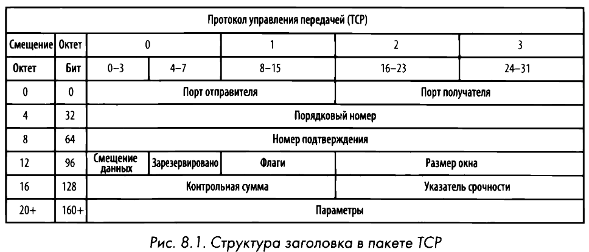
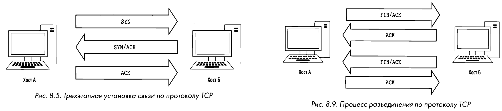

# TCP
Transmission Control Protocol или **Протокол управления передачей** обеспечивает надежную доставку данных из одной конечной точки сети в другую. Определен в [**RFC 793**](https://www.ietf.org/rfc/rfc793.txt). Является распространённым протоколом в сетевой инфраструктуре так, как определяет взаимодействие клиента и сервера приложений (HTTP, FTP, SMTP и т.д.). Весь обмен данными по протоколу ТСР происходит между [**портами**](port.md) отправителя и получателя.

В основе начала соединения лежит **трёхстороннее рукопожатие**:
1) Клиент отправляет серверу запрос **SYN**-пакет (синхронизации);
2) Сервер получает запрос и отвечает пакетом синхронизации/подтверждения (**SYN/ACK**);
3) Когда клиент завершает диалог, отправляется **ACK**-пакет (подтверждения) серверу.

Для завершения связи:
- Клиент сообщает об окончании обмена данными посылкой пакета ТСР с установленными флагами **FIN/АСК**;
- На это сервер отвечает пакетом **АСК** и передает свой пакет **FIN/ACК**;
- Клиент отвечает пакетом **АСК**, завершая обмен данными. 

Eсли устройство не желает принять отправленный ему пакет, оно может отослать пакет ТСР с установленным флагом **RST**. 

