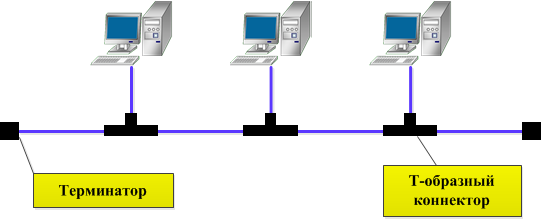
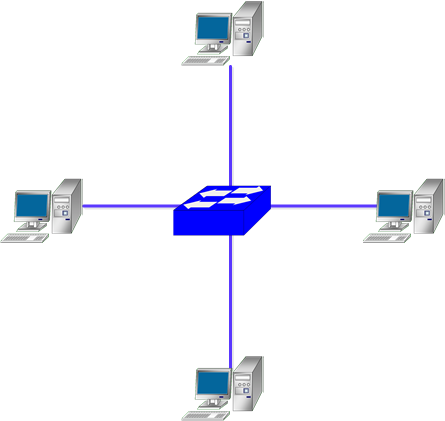
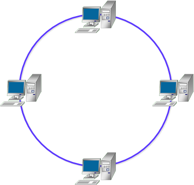
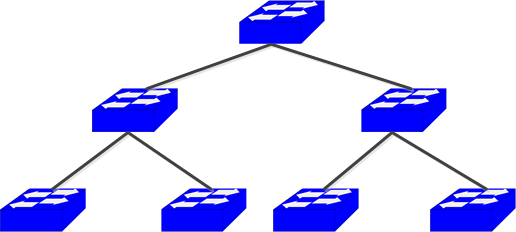
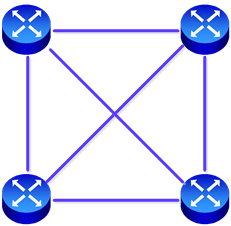
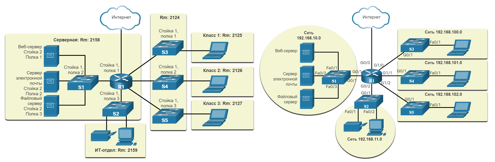
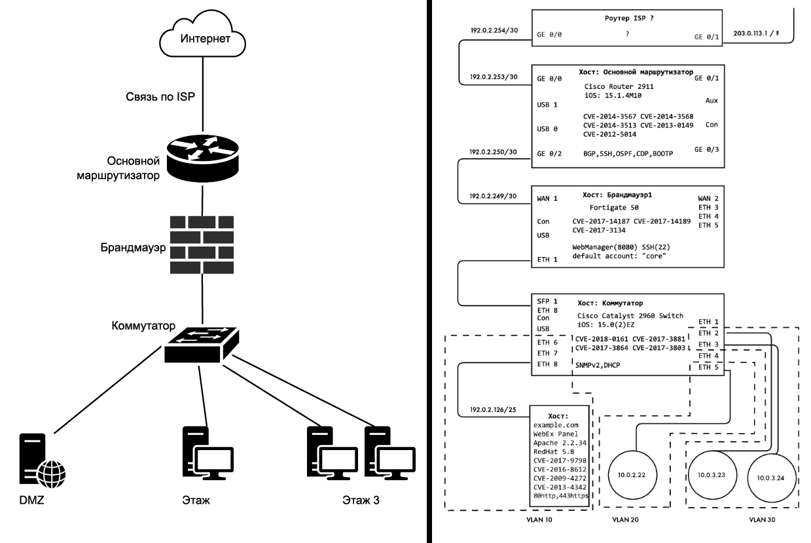

# Топологии сети
**Топологией сети** называют конфигурацию графа, в котором вершинами являются конечные (ПК и серверы) и промежуточные узлы (коммутаторы, маршрутизаторы), а рёбрами — проводная или беспроводная среда передачи данных. От выбора топологии зависят характеристики сети, например, надёжность и масштабируемость. 

Различают **полносвязные** и **неполносвязные** конфигурации. При полносвязной топологии каждый компьютер соединён с остальными, однако на практике это слишком громоздко и дорого, так как требует огромного количества портов и кабелей. Все другие топологии являются неполносвязными и требуют промежуточных узлов для передачи данных.

## Общая шина (Bus)
Является частным случаем "Звезды", так как все устройства подключены к единому средству связи — центральному кабелю (обычно коаксиальному), к которому подключаются все компьютеры. Данные передаются по шине в одном направлении, и устройства ищут свой адрес в данных. В каждый момент времени только один компьютер может передавать данные, поэтому пропускная способность делится между всеми узлами.

**Преимущества:**
- Простота настройки и расширения.
- Требуется меньше кабелей, чем для других топологий.

**Недостатки:**
- Если выходит из строя основной кабель, выходит из строя вся сеть.
- Производительность снижается по мере добавления новых устройств.
- Ограниченная длина кабеля и количество устройств.

## Звезда (Star)
Каждый компьютер подключается к центральному устройству (концентратору, коммутатору или маршрутизатору). Центральная точка отвечает за передачу и направление данных между устройствами в сети.

**Преимущества:**
- Легко добавлять или удалять устройства, не затрагивая остальную сеть.
- Если одно устройство выходит из строя, это не влияет на всю сеть.
- Централизованное управление.

**Недостатки:**
- Требуется больше кабелей, чем в шинной топологии.
- Если центральный узел выходит из строя, падает вся сеть.
- Ограниченный радиус действия: расстояние зависит от длины кабелей до центрального узла, а длинные кабели могут увеличить задержку.

## Кольцо (Ring)
Устройства подключаются по круговой схеме, при этом у каждого устройства есть ровно два соседа. Данные передаются от одного компьютера к другому, проходя через каждое устройство до места назначения. Такая структура упрощает контроль доставки и отслеживание вышедших из строя узлов, а в некоторых реализациях данные могут передаваться в двух направлениях. Используется в технологиях Token Ring и FDDI.

**Преимущества:**
- Равный доступ к ресурсам для всех устройств.
- Может справляться с большими нагрузками на трафик.

**Недостатки:**
- Добавление или удаление устройств может привести к нарушению работы сети.
- Если одно устройство выходит из строя, это может повлиять на всю сеть.
- Передача данных может быть медленной из-за циклической структуры.

## Иерархическая звезда / Дерево (Tree)
Имеет разветвленную структуру и представляет собой сеть, состоящую из нескольких подсетей, подключенных по схеме Звезда к центральным узлам более высокого уровня. Пример: соединение домашних сетей в одном здании через интернет-провайдера.

**Преимущества:**
- Хорошо масштабируемая сеть (большой потенциал для расширения).
- Легко найти неисправности.

**Недостатки:**
- Зависимость нижестоящих узлов от вышестоящих (отказ вышестоящего узла ведет к отказу всей ветки).
- Требуется много кабеля.

## Ячеистая (Mesh) и Полносвязная (Full Mesh)
**Ячеистая топология** происходит из полносвязной путём удаления некоторых связей (частичная сетка). **Полносвязная топология (Full Mesh)** соединяет каждое устройство со всеми остальными напрямую. Это самая надежная схема, так как к одному узлу подключены как минимум 2 соседних устройства, однако она крайне требовательна к ресурсам.

**Преимущества:**
- Высокая отказоустойчивость и избыточность.
- Хорошо масштабируется и устраняет необходимость в центральном узле.

**Недостатки:**
- Требуется огромное количество кабелей, что делает её очень дорогостоящей.
- Сложность в настройке, обслуживании и физической реализации.

## Смешанная / Гибридная (Hybrid)
Представляет собой произвольное соединение компьютеров, объединяя две или более различных топологий в единой сети. Используется в крупных компаниях для адаптации под конкретные требования производительности.

**Преимущества:**
- Может быть адаптирована к конкретным потребностям.
- Оптимизирует сильные стороны различных топологий.

**Недостатки:**
- Сложный процесс управления и настройки.
- Дороже, чем классические базовые топологии.

---

# Карта сети
Топологические схемы (карты) дают наглядное представление о том, какие технические ресурсы входят в сеть и как они соединены. Диаграмма может описывать физическое расположение оборудования (пример слева) или логику соединения и взаимодействия устройств (пример справа).

Отсутствие качественной карты сети — частая проблема в сфере кибербезопасности. Качественная карта сети включает в себя:
- **Все точки доступа узла в сети:** виды интерфейсов, наличие фильтрации (NAC/MAC), статус доступа к консоли, виды физической безопасности (замки), расположение интерфейса управления, IP- и MAC-адреса.
- **Граничные шлюзы, переходы и точки выхода:** количество провайдеров, использование надежных подключений (TIC/MIS), пропускная способность, тип канала связи (оптоволокно, Ethernet и др.), физические и беспроводные пути входа/выхода.
- **Структуру и схему сети:** имена, назначение и размер подсетей (использование CIDR), наличие VLAN, лимиты пулов, иерархия сети (плоская, сегментированная, защитные слои).
- **Хосты и узлы сети:** названия, версии ОС, используемые открытые службы/порты, средства безопасности, наличие общеизвестных уязвимостей (CVE).
- **Физическую и логическую архитектуру:** расположение дата-центра, наличие Ethernet в холле, доступность Wi-Fi снаружи, видимость экранов с улицы, сегментация гостевых сетей, правила брандмауэра и ACL, зона DMZ, облачные сервисы и архитектура VPN/удаленного доступа.

*Примеры бесполезной и полезной карты сети.*

Многие инструменты злоумышленников для отображения сети "шумные" (например, активное сканирование Nmap) и легко обнаруживаются системами безопасности. Опытные злоумышленники применяют пассивное отображение: сбор информации без прямого взаимодействия. Ещё один метод — прослушивание пакетов в беспорядочном (promiscuous) режиме интерфейса, при котором записывается и проверяется весь проходящий сетевой трафик, что позволяет узнать топологию, соседей и протоколы без активных запросов.