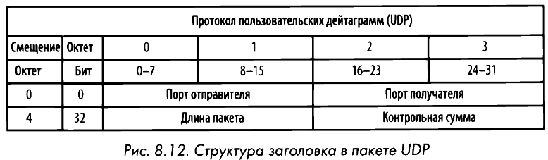

# UDP
User Datagram Protocol или **Протокол пользовательских дейтаграмм** представляет собой сетевое соединение, ориентированное на скорость передачи данных. Примерами приложений, использующих UDP, являются потоковое аудио и видео хостинги. Протокол UDP не обеспечивает надежную доставку пакетов.

