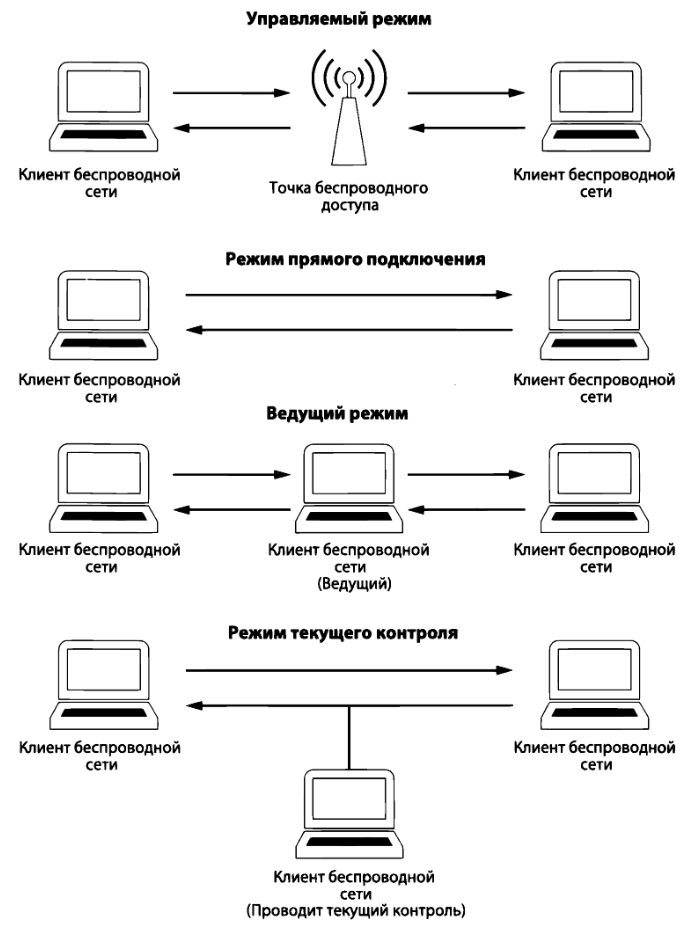

# Беспроводные сети
Частотный спектр беспроводной связи распределен в среде передачи информации по отдельным физическим радиоканалам. В отличие от проводных сетей, где каждый клиент подключается к коммутатору с помощью отдельного кабеля, среда передачи данных по **беспроводным сетям (WLAN - wireless local area network)** является общей для всех клиентов и радиус ее действия ограничен частью частотного спектра по стандартам 802.11 IEEE.

Общий частотный спектр удалось разбить на отдельные каналы связи, где **канал** - это часть частотного спектра беспроводной связи. В России в диапазоне 2,4 ГГц доступными являются 13 каналов, а в диапазоне 5 ГГц — 17 каналов.

При беспроводной связи иногда нельзя полагаться на целостность данных, передаваемых в эфире, поскольку сигналы, распространяемые по радиоканалам, могут накладываться друг на друга, создавая помехи. **Анализатор спектра** - специальный прибор для проверки и отображения взаимных помех в определенном частотном спектре. MetaGeek выпускает **Wi-Spy**, подключаемое к компьютеру через USB-порт и способное контролировать весь спектр сигналов по стандарту 802.11. Программы **inSSIDer** или **Chanalyzer** позволяют выводить анализируемый частотный спектр в графическом виде, чтобы упростить процесс диагностики.
## Перехват пакетов
Традиционный анализ пакетов в беспроводной сети может быть одновременно проведен только в одном канале связи. Существуют приложения, в которых применяется методика **переключением каналов**, позволяющая быстро сменить каналы в целях сбора данных.

**Режимы работы адаптера:**
- **Управляемый режим (Managed mode)** применяется в том случае, если клиент беспроводной сети подключается непосредственной к точке беспроводного доступа.
- **Режим прямого подключения (Ad hoc mode)** применяется в том случае, если организована беспроводная сеть, в которой устройства подключаются непосредственно друг к другу. В этом режиме два клиента разделяют обязанности, которые обычно возлагаются на точку беспроводного доступа.
- **Ведущий режим (Master mode).** Адаптеру разрешается работать вместе со специальным программным драйвером, чтобы компьютер, на котором установлен этот адаптер, действовал в качестве точки беспроводного доступа для других устройств.
- **Режим текущего контроля (Monitor mode)** применяется в том случае, если клиенту требуется остановить передачу и прием данных и вместо этого прослушивать пакеты, распространяемые в эфире. Так же режим может называться **RFMON**, т.е. режимом радиочастотного контроля.

Каждой точке беспроводного доступа в сети присваивается однозначно определяющий её **идентификатор базового набора услуг (Basic Service Set Identifier, BSSID)**. Этот идентификатор посылается в каждом беспроводном пакете управления и пакете данных из передающей точки доступа. Зная идентификатор BSSID, для ее исследования достаточно найти пакет, отправленный из этой конкретной точки.

В **Linux** с помощью команды `iwconfig` можно узнать об интерфейсах беспроводной сети, а так же
- `iwconfig eth1 mode monitor` : перевести интерфейс в режим текущего контроля (прослушки);
- `iwconfig eth1 up` :  включить интерфейс;
- `iwconfig eth1 channel З` : сменить канал связи.

При анализе пакетов в **WireShark** рекомендуется добавить столбцы **Channel** (канал связи), **Signal Strength** (мощность сигнала) и **Data Rate** (скорость передачи данных).
## Структура пакета
Главное отличие пакетов в беспроводной сети от пакетов в проводной сети заключается в наличии дополнительного заголовка. Этот заголовок второго уровня содержит дополнительные сведения о пакете и среде, в которой он передается. Имеются следующие типы пакетов:
- **Пакеты управления (Management)** служат для установки связи между хостами на втором уровне (пакеты аутентификации, установки связи и сигнальные пакеты).
- **Пакеты контроля (Control)** обеспечивают гарантированную доставку пакетов управления и данных и предназначены для управления процессом устранения перегрузки (пакеты с запросами на передачу и подтверждением готовности к приему).
- **Пакеты данных (Data)** содержат конкретные данные и относятся к тем типам пакетов, которые могут быть направлены из беспроводной сети в проводную.
## Безопасность беспроводных сетей
Стоит упомянуть, если применяется шифрование на другом уровне [**модели OSI**](osi--tcp-ip.md) (например, по протоколу **SSL** или **SSH**), сетевой трафик уже будет зашифрован при переходе на более низкие уровни.

Первоначально наиболее предпочтительным методом защиты данных считалось соблюдение стандарта **WEP** (Wired Equivalent Privacy - эквивалент конфиденциальности проводных сетей), но в нём были найдены слабые места в алгоритме управления ключами шифрования. Для повышения безопасности были разработаны новые стандарты, в том числе **WPA** (Wi-Fi Protected Access - защищенный беспроводный доступ к сети), **WPA2** и **WPA3** (с более безопасным алгоритмом). 

**Аутентификация по алгоритму WEP:**
- Точка беспроводного доступа пытается выяснить, есть ли у беспроводного клиента WЕР-ключ.
- В ответ на этот запрос беспроводный клиент расшифровывает текст запроса с помощью WЕР-ключа и возвращает его в открытом виде. WЕР-ключ вводится пользователем при попытке подключения к беспроводной сети.
- Точка беспроводного доступа уведомляет беспроводного клиента об удачном завершении процесса аутентификации.

**Аутентификация по алгоритму WPA:**
- Посылается сигнальный пакет, переданный в широковещательном режиме из точки беспроводного доступа.
- Как только сигнальный пакет будет получен, беспроводный клиент передает в широковещательном режиме зондирующий запрос (probe request), который принимается точкой беспроводною доступа.
- После этого происходит обмен пакетами с запросами на аутентификацию и установку связи между беспроводным клиентом и точкой беспроводного доступа.
- При неудачной попытке аутентификации будут направлены пакеты по протоколу **EAPoL** (Extensible Authentication Protocol over LAN - расширяемый протокол аутентификации в локальной сети).